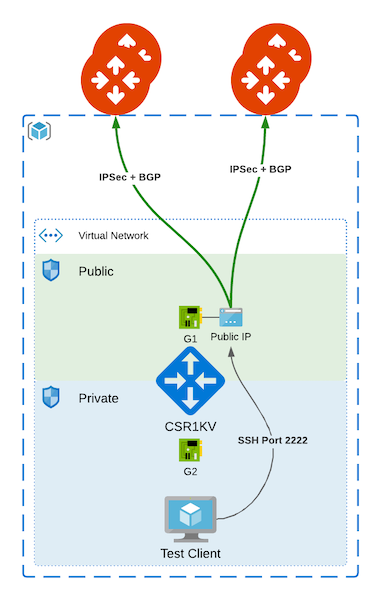

# Aviatrix-Easy-Onprem

This is a wrapper around the [aviatrix-demo-onprem-aws](https://github.com/gleyfer/aviatrix-demo-onprem-aws) and [aviatrix-demo-onprem-azure](https://github.com/gleyfer/aviatrix-demo-onprem-azure) modules, which allows the creation of the following topologies with a few lines:

 

**NOTE**: This template utilizes the CSR1K BYOL offer in the AWS or Azure marketplace. To subscribe to the offer:
- AWS: https://aws.amazon.com/marketplace/pp/prodview-tinibseuanup2
- Azure (paste into Cloud Shell):
```powershell
Get-AzureRmMarketplaceTerms -Publisher "cisco" -Product "cisco-csr-1000v" -Name "17_3_3-byol" | Set-AzureRmMarketplaceTerms -Accept
```

# Instructions

Please modify the terraform.tfvars and configure the AWS, Azure, and Aviatrix provider credentials. There are additional options which you can configure for the aviatrix-demo-onprem module which are commented out and you can uncomment and adjust as needed.

Example of quickly deploying the topology with a test client and creating an S2C+BGP Connection over public IPs to an Aviatrix gateway:

```bash
terraform init
terraform plan -var cloud_type="aws" -var public_conns='["Test-Transit:64525:1"]' -var aws_region="us-west-2" -var create_client=true
terraform apply -var cloud_type="aws" -var public_conns='["Test-Transit:64525:1"]' -var aws_region="us-west-2" -var create_client=true
```

Example with a private external connections in Azure (requires VNet peering, Pureport, etc):

```bash
terraform init
terraform plan -var cloud_type="azure" -var private_conns='["Test-Transit:64525:1"]' -var azure_location="East US" -var create_client=true
terraform apply -var cloud_type="azure" -var private_conns='["Test-Transit:64525:1"]' -var azure_location="East US" -var create_client=true
```

You can specify both public_conns and private_conns together.

Format:

```terraform
["gatway-name:gateway-bgp-as-num:num_vrfs", "second-gw-name:second-gw-bgp-as-num:num_vrfs", ...]
```
**NOTE:** Currently, num_vrfs can only be set to 1. This is reserved for future use with multi-vrf use-cases.

Defaults:

- **aws_region:** us-east-1
- **azure_location:** East US
- **vpc_cidr:** 172.16.0.0/16
- **public_sub:** 172.16.0.0/24
- **private_sub:** 172.16.1.0/24
- **hostname:** onprem-csr
- **aws_instance_type:** t2.medium
- **azure_instance_size:** Standard_DS2_v2
- **csr_bgp_as_num:** 64527
- **create_client:** false

You can override the defaults either by specifying them as a var on the command line (e.g., -var network_cidr="10.100.0.0/16") or modifying the terraform.tfvars

Explanation of arguments:

- **cloud_type:** Which CSP to deploy the CSR1K and related resources into. Current supported values are : "aws", "azure"
- **azure_rg (optional):** Existing Azure Resource group to deploy CSR1K and associated resources into.
- **azure_location:** If using Azure, the location into which to deploy the CSR1K
- **aws_region:** If using AWS, the region into which to deploy the CSR1K
- **hostname:** The hostname which will be configured on the CSR and which will prefix all of the resources created.
- **network_cidr:** The VPC CIDR block to use when creating the VPC/VNet which the CSR will reside in.
- **public_sub:** The public subnet for the CSR public facing interface.
- **private_sub:** The private subnet for the CSR private facing interface. If enabled, the test client will be created in this subnet.
- **aws_instance_type:** The AWS instance type to launch the CSR with. Default is t2.medium.
- **azure_instance_size:** The Azure instance size to launch the CSR with. Default is Standard_DS2_v2
- **public_conns:** List of public external connection definitions (please see above example for format). Tunnels will be created to primary and hagw automatically.
- **private_conns:** List of private external connection definitions (For DX, please see above example for format). Tunnels will be created to primary and hagw automatically.
- **csr_bgp_as_num:** BGP AS Number to use on the CSR.
- **create_client (optional):** If enabled, creates an amazon linux instance in the private subnet, configures public SG/NSG to allow port 2222 and configures a port forward on the CSR to allow SSH into the test instance using the CSR IP and port 2222. SSH Key used for the instance will either be the one specified in key_name or generated automatically. Disabled by default.

Outputs:

- **CSR_Public_IP:** Public IP of CSR instance
- **CSR_SSH_Cmd:** SSH Command to directly access the CSR
- **Client_SSH_Cmd:** SSH Command to access the test client
